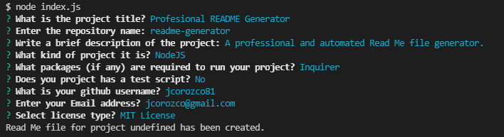

# Project: Professional README Generator 
    Professional README file generator
  

  
## Description
***

  In order to help the professional developers to have better use of their time, an automated Read Me file generator was created. The **Professional README Generator** prompts the user for a series of questions such as Project Title, repository name, user contact information, type of project, type of license, and other required information that will be used to create the readme structure and to fill the sections with standardized information. This script was created to run in the **Node JS** runtime environment.


## Table of Contents
***  

- [Installation](#installation)
- [Usage](#usage)
- [How to Contribute](#How)
- [Tests](#Tests)
- [Questions](#Questions)
- [License](#license)

  
  
## Installation
***

  The installation can be completed by following these instructions:
    
1. To install a Node JS project, install [Node JS](https://nodejs.org/)       

2. Clone the GitHub repository to you local computer. Click on the following link.
 
  * Repository link : https://github.com/jcorozco81/readme-generator


Additional packages required: [Inquirer package](https://www.npmjs.com/package/inquirer). 

1. To install inquirer initialize the repository with a ```package.json``` file by running ```npm init -y```.

2. Install inquirer and add it to the list of dependencies by running ```npm i inquirer --save```.

  


## Usage
***

   1. To execute the script, open a Git terminal on the main project folder (cloned folder) Run the following command: ```node index.js```.

   2. A series of questions will be displayed, all the answers will be used to generate the Read me file. If the file is successfully created it will return a message indicating that the file was created. The filename of the file created is ```READ-ME.md``` and it will be created in the same folder where the ```index.js``` script was executed.

      
  


## How to Contribute
***

  Developers who are interested in contributing ideas for this application must agree to follow and comply with the Contributor Covetnant: Code of Conduct. The Contributor Covenant Code of Conduct can be found in the following address:

  [Contributor Covenant Code of Conduct](https://www.contributor-covenant.org/version/2/0/code_of_conduct/code_of_conduct.md/)


## Tests
***
  
  No test was written for this application/software.


## Questions
***
  
  You can find additional projects on my github page: https://github.com/jcorozco81.

  If you have any questions please contact me at my E-Mail address: jcorozco@gmail.com.


## License
***

Copyright (c) 2021 jcorozco81.


This software/code is licensed under the MIT License; to use this software/code you must agree to follow and comply the License. A copy of the License can be found at:

https://www.mit.edu/~amini/LICENSE.md


